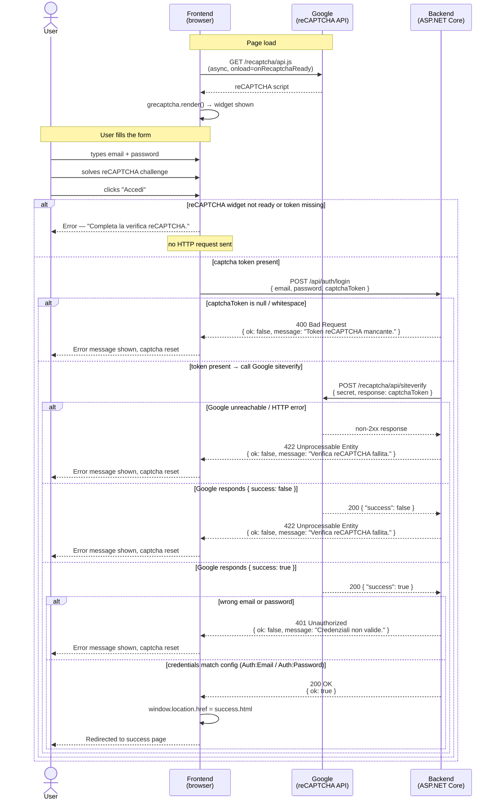

# Login Flow — FE → BE → Google

## Scenario summary

| # | Scenario | Triggered by | HTTP status | Outcome |
|---|----------|-------------|-------------|---------|
| 1 | reCAPTCHA widget not ready or unchecked | FE guard | — (no request) | Error shown, captcha reset |
| 2 | Missing token reaches BE | Empty `captchaToken` field | 400 Bad Request | Error shown, captcha reset |
| 3 | Google API unreachable | Network error / non-2xx from Google | 422 Unprocessable Entity | Error shown, captcha reset |
| 4 | Google rejects token | `{ "success": false }` from siteverify | 422 Unprocessable Entity | Error shown, captcha reset |
| 5 | Wrong credentials | Email or password mismatch vs config | 401 Unauthorized | Error shown, captcha reset |
| 6 | Happy path | All checks pass | 200 OK | Redirect to `success.html` |
